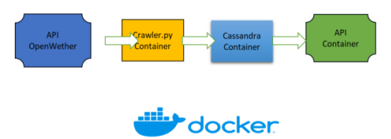
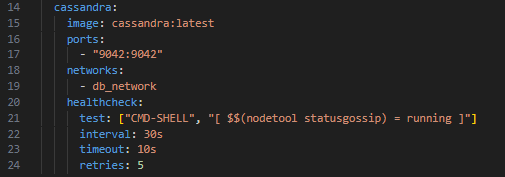
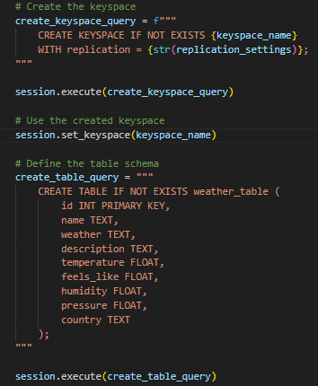
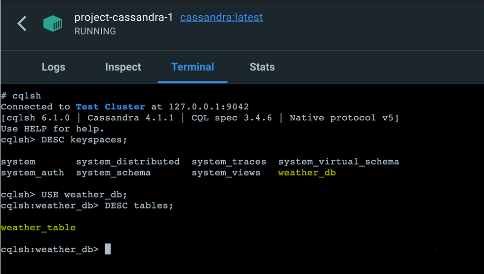
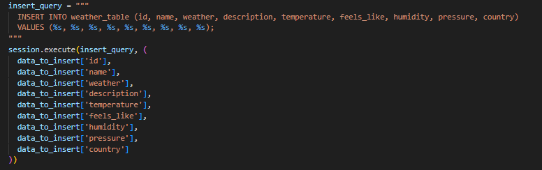
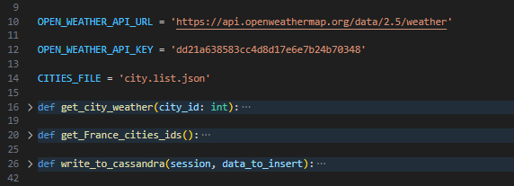
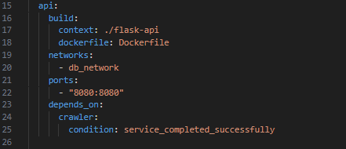
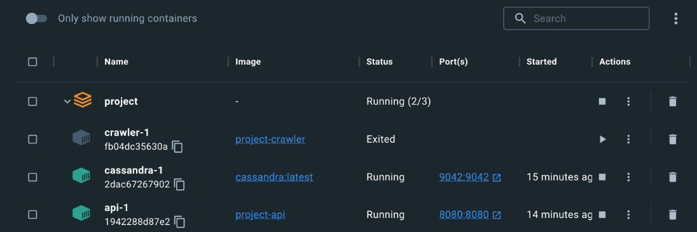

 ## Projet d’exploration de données météorologiques
Ce projet vise à explorer les données météorologiques de l’API OpenWeather https://openweathermap.org pour les villes de France et à stocker les données récupérées dans une base de données Cassandra. Une API est également là pour nous permettre de récupérer des informations météorologiques à partir de la base de données.

Il implémente le pipeline illustré ci-dessous :

## Résumé du Projet
Cette initiative englobe les composants clés suivants :

Base de données Cassandra : Une base de données NoSQL servant de référentiel pour les données liées à la météo.
Service de Crawling : Développé en Python, ce service est chargé d'acquérir les données météorologiques de l'API OpenWeather et de les stocker dans la base de données Cassandra.
Service Flask-API : Également développé en Python, ce service extrait les informations météorologiques de la base de données et répond aux requêtes de l'API.
Docker Compose : Un outil d'orchestration qui facilite la communication entre la base de données Cassandra et le service de Crawling.
Dockerfiles : Les définitions pour créer des conteneurs Docker destinés à la fois à Cassandra et au service de Crawling.

## Prérequis
Pour participer à ce projet, les prérequis suivants sont nécessaires :

Docker
Docker Compose

Composants
Cassandra
Configuration : La base de données Cassandra a été conteneurisée en utilisant l'image Docker officielle de Cassandra. Elle est configurée pour fonctionner sur le port 9042 et peut être accessible via le nom d'hôte 'cassandra' dans le réseau Docker. Un mécanisme de vérification de l'état de santé garantit que la base de données est opérationnelle avant que le service de Crawling ne commence l'insertion des données.

Initialisation de Cassandra
Le script init_db.py joue un rôle central à ce stade. Il définit la fonction 'init_db', responsable de la création de l'espace de clés Cassandra et de la définition du schéma de la table. Ce schéma comprend des champs pour accueillir divers paramètres météorologiques tels que la température et l'humidité.

Après la configuration, un espace de clés nommé weather_db et une table nommée weather_table sont créés dans le conteneur Cassandra. La validation de cette configuration peut être effectuée à l'aide de l'outil en ligne de commande 'cqlsh'.

## Service de Crawling
Le service de Crawling est chargé de récupérer les données météorologiques de l'API OpenWeather et de les stocker dans la base de données Cassandra.

Configuration : Le fichier Dockerfile dans le répertoire 'crawler' est responsable de la conteneurisation du service de Crawling. Il utilise une image Python 3.6-slim pour garantir que les bibliothèques et les scripts essentiels sont disponibles dans le conteneur lancé.

Logique de Crawling : Le script central, crawler.py, est le cœur de ce service. Il gère à la fois la récupération des données et leur insertion ultérieure dans la base de données. Plusieurs fonctions cruciales sont mises en œuvre :

get_city_weather(city_id) : Cette fonction récupère les données météorologiques pour un ID de ville spécifique à partir de l'API OpenWeather, en utilisant la bibliothèque 'requests'.
get_France_cities_ids() : Les données sont collectées sélectivement pour les villes situées en France, en se basant sur les ID de ville.
write_to_cassandra(session, data_to_insert) : Cette fonction définit la requête responsable de l'insertion des données dans la base de données Cassandra.

Après la récupération des données via l'API, celles-ci sont formatées avant d'être insérées dans la base de données. Ce processus est appliqué aux 100 premiers enregistrements météorologiques, après quoi ils sont stockés dans la table désignée.

## Service Flask-API
Le service Flask-API est chargé de récupérer les données météorologiques pour une ville spécifique, en se basant sur

Configuration : De manière similaire au service de Crawling, le service Flask API est conteneurisé en utilisant une image Python 3.6-slim. Il garantit la présence des bibliothèques et des scripts nécessaires dans le conteneur. Il est important de noter que le service API doit attendre que le service de Crawling ait terminé sa tâche pour éviter les problèmes de connexion.

Logique : Le script main.py dans le dossier 'flask-api' établit l'API, facilitant la récupération des données météorologiques pour des villes spécifiques stockées dans la base de données Cassandra. Lorsqu'un client initie une requête GET vers l'endpoint "/weather", l'API identifie la ville demandée à partir du paramètre de requête. Ensuite, elle interroge la base de données Cassandra, sélectionnant les données météorologiques pertinentes pour la ville spécifiée. Ces données sont ensuite traitées et transformées en une réponse JSON, comprenant des détails tels que le nom de la ville, les conditions météorologiques et la température. L'API utilise le module de requête de Flask pour gérer les requêtes entrantes et le module cassandra.cluster pour établir une connexion avec la base de données Cassandra. Une fois que le conteneur est opérationnel, l'API est accessible.

Pour tester la fonctionnalité, une requête simple est envoyée avec le nom de la ville souhaitée, comme "Zutkerque". Par la suite, des informations météorologiques variées pour cette ville sont récupérées.
 

## Exécution
Pour exécuter le projet :

Accédez au répertoire du projet via un terminal.
Exécutez la commande docker-compose up pour démarrer la base de données Cassandra, le service de Crawling et le service Flask API.

